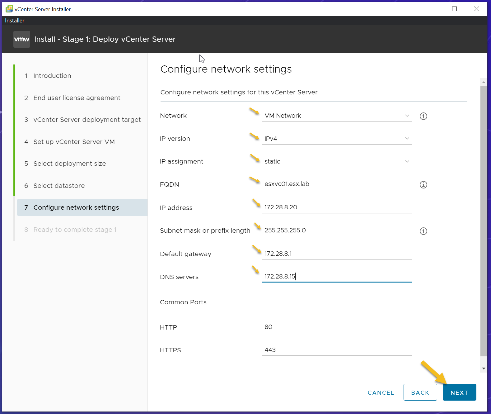

# Configure and Deploy vCenter Server Appliance (VCSA)

## Change to Desktop Directory
```bash
cd ~/Desktop
```

## Create Folder
```bash
sudo mkdir Vcenter
```

## Change to Folder
```bash
cd Vcenter
```

## Download the VCSA from the Internet
```bash
wget https://mirror.mahanserver.net/VMware/VCenter/7.0.0/VMware-VCSA-all-7.0.0-16189094.iso
```

## Deploy VCSA using the Following Steps:

### 1. Mount the VCSA .ISO You Downloaded


### 2. Open the Folder Called “vcsa-ui-installer”


### 3. Choose the Correct Folder Depending on Your Operating System
- Since this guide uses Ubuntu 22.04 to deploy VCSA, select the “lin64” folder.


### 4. Open Terminal and Run the "installer" File


### 5. Choose “Install” and Click “Next” on the Introduction Screen


### 6. Accept the End User License Agreement and Click Next


### 7. Specify the Target for the VCSA Deployment
- The target can be an ESXi host or an existing vCenter Server.
- For this demo, use a standalone ESXi host.
- Complete the form and click “Next.”

**Note:** A Certificate Warning might appear. Click “Yes” to continue.

### 8. Specify VM Settings for the vCenter Server
- **VM Name**: Name of the Virtual Machine
- **Set root password**: Provide a password
- **Confirm root password**: Confirm the root password


### 9. Select the VCSA Deployment Size for Your Environment
- For this demo, use “Small” for deployment size and “Default” for storage size.


### 10. Select Datastore to Identify the Storage Location for the VCSA


### 11. Configure the Network Settings of the VCSA

1. **Network**: Select the port group to be used for the VCSA
2. **IP Version**: Select either IPv4 or IPv6
3. **IP Assignment**: Select either Static or DHCP
4. **FQDN**: Provide the fully qualified domain name (FQDN) or IP address of the VCSA (e.g., `vcentername.domain.com` or `x.x.x.x`)
5. **IP Address**: Provide the IP address of the VCSA (e.g., `x.x.x.x`)
6. **Subnet Mask or Prefix Length**: Provide the subnet mask or prefix length of the VCSA network (e.g., `x.x.x.x` or `xx`)
7. **Default Gateway**: Provide the default gateway (e.g., `x.x.x.x`)
8. **DNS Servers**: Provide the DNS server IP addresses for the VCSA (e.g., `x.x.x.x,x.x.x.x`)
9. **Common Ports**: Leave defaults unless customization is needed for your environment.

### 12. Review Your Configuration and Click “Finish” to Initiate Stage 1 of Deploying the VCSA


### 13. After Successfully Completing Stage 1 of the VCSA, Click “Continue” to Proceed to Stage 2


### 14. Review the Introduction Screen and Click “Next” to Continue


### 15. Configure NTP and SSH for the VCSA

#### 1. Time Synchronization Mode
Select one of the following:
1. **Synchronize Time with NTP Server**:
   - Uses a Network Time Protocol server for synchronizing the time.
   - Enter the names or IP addresses of the NTP servers separated by commas.
2. **Synchronize Time with the ESXi Host**:
   - Enables periodic time synchronization.
   - VMware Tools sets the time of the guest operating system to match the time of the ESXi host.

#### 2. SSH Access
Select one of the following:
- **Disabled**
- **Enabled**

### 16. Choose Your SSO Configuration and Click “Next” to Continue


### 17. Configure CEIP and Click “Next” to Continue


### 18. Review the "Ready to Complete" Screen and Verify Configuration
- Click “Finish” to Initiate Stage 2


### 19. After Successfully Completing Stage 2
- A URL will be presented. Click the URL to launch the vSphere Client.
- You can now close the vCenter Server Installer.


### 20. Click “Launch vSphere Client (HTML5)”


### 21. Log into vSphere Client Using administrator@vsphere.local Account


### 22. Successfully Deployed the vCenter Server Appliance!

