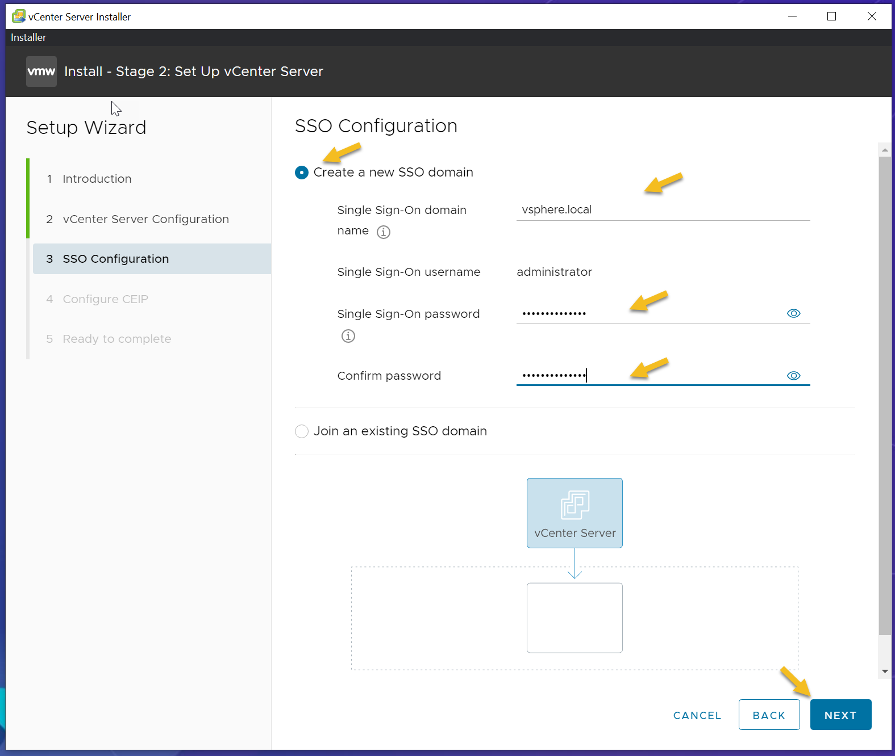

## change to Desktop Directory
    cd ~/Desktop
## Create Folder  
    sudo mkdir Vcenter
## change to Folder
    cd Vcenter
## Download the Vcenter for Internet   
   wget https://mirror.mahanserver.net/VMware/VCenter/7.0.0/VMware-VCSA-all-7.0.0-16189094.iso
## Deploy Vcenter using this Steps:

1-  Mount the VCSA .ISO you downloaded
   

2- Open the folder called “vcsa-ui-installer”
   

3- Choose the correct folder depending on the operating system you’re deploying the VCSA from. Since I am using ubuntu 22.04 to deploy VCSA, I will select “lin64” folder.
   

4-  open Terminal and Run "installer" file
    

5- Choose “Install” and click “next” on the introduction screen.
    

6- Accept the End user license agreement and click next
    

7- Specify target where vCenter server appliance will be deployed. The target can be ESXi host or existing vCenter server. In this demo I will be using a standalone ESXi host. Once you have completed form, click “Next” to continue.
    
   **Note: A Certificate Warning might appear. Click “Yes” to continue**

8- Specify the VM settings for the vCenter Server. Click “Next” to continue.
    VM Name - Name of the Virtual Machine
    Set root password - Provide a Password
    Confirm root password - Confirm the root password
    

9- Select the VCSA deployment size for your enviroment. In this demo I will be using “Small” for deployment size and “Default” for Storage Size. Click “Next” to continue.
     

10- Select Datastore to idenifty the storage location for the VCSA. Click “Next” to continue.    
    

11- Configure the network settings of the VCSA. Click “Next” to continue.
        

    1- Network - Select the port group to be used for the VCSA
    2- IP Version - Select either IPv4 or IPv6
    3- IP assignment - Select either Static or dhcp
    4- FQDN - Provide the fully qualified domain name (FQDN) or IP address of the VCSA. (vcentername.domain.com or x.x.x.x) 
    5- IP Address - Provide the IP address of the VCSA (x.x.x.x)

    6- Subnet Mask or Prefix Length - Provide the Subnet mask or Prefix Length of the VCSA network. (x.x.x.x or xx)
    7- Default Gateway - Provide the Default Gateway (x.x.x.x)
    8- DNS Servers - Provide the DNS server IP address for the VCSA. (x.x.x.x,x.x.x.x)
    9- Common Ports - Leave Defaults unless you need to customize them for your enviroment.

12- Review your configuration and Click “Finish” to initiate stage 1 of deploying the VCSA.
    

13- After sucessfully completing stage 1 of the VCSA. Click “Continue” to proceed to stage 2.
    

14- Review the introduction screen and Click “Next” to continue.
     

15- Configure NTP and SSH configuration for the VCSA. After configuring NTP and SSH, Click “Next” to continue.
    
    1- Time synchronization mode
        Select one of the following:
            1). synchronize time with NTP Server
                Uses a Network Time Protocol server for synchronizing the time. If you select this option, you must enter the names or IP addresses of the NTP servers separated by commas.
            2) synchronize time with the ESXi host
                Enables periodic time synchronization, and VMware Tools sets the time of the guest operating system to be the same as the time of the ESXi host.
    2- SSH Access
        Select one of the following:
            - Disabled
            - Enabled
16- Choose your SSO Configuration and Click “Next” to continue.
     

17- Configure CEIP and Click “Next” to continue
    

18- Review Ready to complete screen and verify configuration. Click “Finish” to initiate stage 2.
     

19- After sucesfully completing stage 2, you will be presented with a URL. Click the URL to launch the vSphere Client. You can now close the vCenter Server Installer.
       

20- Click “Launch vSphere Client (HTML5)”
   

21- Log into vSphere client using administrator@vsphere.local account.
    

22- You have succesfully deployed the vCenter Server Appliance!
    

   
   
